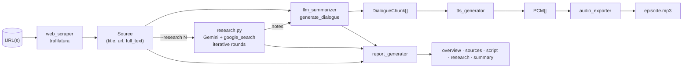

# tts-podcast — MVP plan

**Status:** pending approval
**Date:** 2026-05-23
**Mode:** direct
**Author:** obeone (via Claude)
**Target dir:** `/Users/obeone/Documents/geek/github/tts-podcast`
**Reference codebase:** `/Users/obeone/Documents/geek/github/tldr` (heavily reused, MIT)

---

## 1. Requirements Summary

Build a CLI tool inspired by `tldr-podcast` that takes one (or several) **arbitrary
article URLs** as input and produces a two-voice podcast (MP3/WAV) discussing the
content.

Key delta vs. `tldr-podcast`:

- **Input is a URL**, not a TLDR newsletter topic.
- Optional **iterative Google Search enrichment** via Gemini's
  [`google_search` grounding tool](https://ai.google.dev/gemini-api/docs/google-search).
  Each research round builds on the previous round's findings.
- No newsletter parsing, no interest-ranking step, no email/IMAP path.
- Keep tldr's TTS pipeline, audio export, report generation, retry, and token
  tracking essentially intact (verbatim copy + import-path rename).

---

## 2. Acceptance Criteria

| # | Criterion | Verification |
|---|---|---|
| AC1 | `tts-podcast run <URL>` fetches the article, generates a two-voice dialogue, and writes an MP3 + report folder. | Run on a real article; check `*.mp3` exists and report folder contains `overview.md`, `script.md`, `summary.md`. |
| AC2 | `tts-podcast run <URL> --research 0` skips the search-enrichment step entirely (no extra API calls beyond scripting + TTS). | Inspect token tracker output: only `text_model` + `tts_model` calls recorded. |
| AC3 | `tts-podcast run <URL> --research 2` performs **two** sequential Google Search-grounded research rounds; round 2 receives round 1's notes in its prompt. | Capture intermediate prompts in DEBUG logs; assert round-2 prompt contains round-1 findings. |
| AC4 | `tts-podcast run <URL> -n` (dry-run) prints the dialogue to stdout and exits 0 without calling TTS. | Run with `-n`; check exit code and absence of `.mp3`. |
| AC5 | `tts-podcast run <URL> -A` (no-audio) generates script + report but no audio file. | Check report folder exists, no `.mp3` exists. |
| AC6 | `tts-podcast config show` prints the YAML configuration. | Run after `config init`; expect non-empty YAML output. |
| AC7 | Research notes appear in the report folder as `research.md` when `--research >= 1`. | After a run with `--research 1`, check file exists and contains grounding citations. |
| AC8 | `--research N` accepts any non-negative integer; rejects negative. | Run `--research -1` → exit non-zero with clear message. |
| AC9 | When a URL fails to scrape (HTTP error, no content), the run aborts with a clear error message, no audio produced. | Run with `https://invalid.example.invalid` → exit non-zero. |
| AC10 | `tts-podcast --version` prints the package version and exits. | Compare to `pyproject.toml` `version`. |

---

## 3. Architecture & Module Layout

```text
tts-podcast/
├── pyproject.toml                    ✅ created
├── .gitignore                        ✅ created
├── README.md                         📝 to write
├── config.example.yaml               📝 to write
├── src/tts_podcast/
│   ├── __init__.py                   ✅ created (version=0.1.0)
│   ├── cli.py                        📝 new (Click CLI: run / config / completions)
│   ├── config.py                     📋 adapt (drop config_migrations import)
│   ├── models.py                     📝 new (`Source` dataclass)
│   ├── user_agent.py                 📋 verbatim
│   ├── retry.py                      📋 verbatim
│   ├── token_tracker.py              📋 verbatim
│   ├── audio_exporter.py             📋 verbatim
│   ├── link_extractor.py             📋 verbatim (rename import → tts_podcast.models)
│   ├── web_scraper.py                📋 adapt (drop cloak fallback, simpler API for any URL)
│   ├── tts_generator.py              📋 verbatim (rename import → tts_podcast.*)
│   ├── research.py                   📝 new (iterative Google Search grounding)
│   ├── llm_summarizer.py             📋 adapt (drop ranking + bulk summarize; accept research_notes)
│   └── report_generator.py           📋 adapt (drop "topics/date" semantics, add research.md, different folder name)
└── tests/
    ├── __init__.py
    ├── test_research.py              📝 unit tests for round 0/1/N prompt construction
    ├── test_web_scraper.py           📝 happy path + failure (with mocks)
    └── test_llm_summarizer.py        📝 prompt building w/ + w/o research notes
```

Legend: ✅ done, 📋 copy/adapt from tldr, 📝 new file.

### Data flow



---

## 4. Iterative Research Design (`research.py`)

### Public API

```python
@dataclass
class ResearchRound:
    index: int                       # 0-based
    query_hint: str                  # what we asked Gemini to investigate
    notes: str                       # markdown notes Gemini returned
    citations: list[Citation]        # extracted from grounding metadata
    raw_search_queries: list[str]    # queries Gemini actually issued

@dataclass
class Citation:
    title: str
    uri: str

@dataclass
class ResearchReport:
    rounds: list[ResearchRound]
    combined_notes: str              # all rounds concatenated, ready for LLM prompt

def conduct_research(
    sources: list[Source],
    rounds: int,
    gemini_cfg: dict,
    token_tracker: TokenTracker | None = None,
    progress: Progress | None = None,
    task_id: Any = None,
) -> ResearchReport:
    ...
```

### Round 0 (special case)

`rounds == 0` → return empty `ResearchReport`; skip all API calls.

### Round 1 prompt (initial)

> You are a research assistant for a podcast. Given the article(s) below,
> identify the most interesting **complementary** angles a curious listener
> would want to know — background context, recent developments, contradicting
> takes, technical depth the article skips, related work. Use Google Search
> aggressively. Cite every fact you add. Produce ≤ 800 words of bullet-point
> notes in **{language}**.

Tools: `[Tool(google_search=GoogleSearch())]`.

### Round N prompt (N ≥ 2)

> Below: the original article(s) **plus** the research notes from rounds 1…N-1.
> Identify **gaps**, **uncertainties**, and **unanswered questions** the previous
> rounds left open. Use Google Search to drill into those gaps specifically.
> Do **not** repeat facts already covered. Produce ≤ 600 words of new notes in
> **{language}**. Cite every fact.

This ensures each round is **strictly additive** and search queries become more
targeted as the loop progresses.

### Grounding metadata extraction

The `google-genai` SDK exposes `response.candidates[0].grounding_metadata` with
`grounding_chunks` (each having `web.uri` + `web.title`) and `web_search_queries`.
We extract both into the `ResearchRound` dataclass.

### Token tracking

Each round records usage under the model name (e.g. `gemini-2.5-flash`) via the
shared `TokenTracker`. Grounding adds extra input tokens but the same
`record_usage` path covers it.

---

## 5. CLI surface (`cli.py`)

```text
tts-podcast run URL [URL ...] [OPTIONS]

  -c, --config PATH            YAML config (default: $XDG_CONFIG_HOME/tts-podcast/config.yaml)
  -R, --research INT           Number of Google-Search-grounded research rounds [default: 0]
  -o, --output-dir PATH        Output directory (overrides config)
  -n, --dry-run                Print dialogue to stdout, skip TTS
  -A, --no-audio               Generate script + report, skip TTS
  -r/--report / --no-report    Generate report folder [default: on]
      --no-progress            Disable rich progress bar
  -v, --verbose                DEBUG logging
  -h, --help                   Show this message

tts-podcast config init
tts-podcast config show [--resolve]
tts-podcast --version
```

Stem for output files: derived from the first URL's hostname + first 6 chars of a
sha1 of the URL list — e.g. `arxiv.org-a1b2c3-2026-05-23.mp3`. Avoids long stems
and collisions when running multiple URLs through the same domain.

---

## 6. Implementation Steps (ordered)

1. **Foundation** (already done): `pyproject.toml`, `.gitignore`,
   `src/tts_podcast/__init__.py`.
2. **Verbatim copies** with import-path renames:
   `user_agent.py`, `retry.py`, `token_tracker.py`, `audio_exporter.py`.
3. **`models.py`** — define `Source` dataclass:
   `url, title, summary, full_text, scraped_ok`. (No `interest_score`, no
   `section`.)
4. **`link_extractor.py`** — copy verbatim; only import line changes
   (`from tts_podcast.models import Source` instead of `Article`). Internally
   it just reads `url`, `title`, `full_text`, `summary` attributes, so the
   `Source` dataclass exposes the same shape (`title` ← article title).
5. **`web_scraper.py`** — adapted: one function `scrape_url(url, ...) -> Source`
   that fetches with trafilatura, sets `title` (from extracted metadata or URL),
   `full_text`, `summary` (= first 500 chars of full text), `scraped_ok`.
   Parallel `scrape_urls(urls, ...)` for multi-URL case. **No cloak fallback**
   (keeps deps light; can be re-added later behind an extra).
6. **`config.py`** — copy tldr's loader, drop the
   `from tldr.config_migrations import upgrade_config_if_needed` line and the
   migration call. Keep `*_env` resolution and `ConfigError`.
7. **`research.py`** — new module. See section 4 above. Uses
   `types.Tool(google_search=types.GoogleSearch())`.
8. **`tts_generator.py`** — copy verbatim, rename imports
   (`from tldr.retry` → `from tts_podcast.retry`,
   `from tldr.llm_summarizer import DialogueChunk` → `from tts_podcast.llm_summarizer import DialogueChunk`).
9. **`llm_summarizer.py`** — adapted:
   - Keep `DialogueChunk`, `_build_prompt`, `_split_dialogue_into_chunks`,
     `_audio_tags_enabled`, `generate_dialogue`.
   - **Drop** `_RANKING_PROMPT_TEMPLATE`, `rank_articles_by_interest`,
     `_summarize_single_article`, `summarize_articles`, `_SUMMARY_PROMPT_TEMPLATE`.
   - **Add** a `research_notes: str = ""` kwarg to `generate_dialogue`. When
     non-empty, inject it into the prompt before the article list under a
     "Complementary research" section, with explicit instruction to weave the
     extra context in naturally and to cite sources by URL when relevant.
10. **`report_generator.py`** — adapted:
    - Drop the `topics: list[str]` and `target_date: date` parameters; instead
      take `sources: list[Source]` and `research: ResearchReport | None`.
    - Rename `articles.md` → `sources.md`.
    - Add `research.md` (one section per round, with citations) when research
      ran.
    - Update `overview.md` table to include "Research rounds" row.
    - Folder name pattern: `tts_<stem>/` (instead of `tldr_<timestamp>/`).
11. **`cli.py`** — new, structured like tldr's CLI but simplified. Variadic URL
    args via `click.argument("urls", nargs=-1, required=True)`. Adds
    `--research / -R` int option. Drops the topic-selection interactive flow
    entirely. Keeps `--dry-run`, `--no-audio`, `--report/--no-report`,
    `--verbose`, `--output-dir`, `--no-progress`.
12. **`config.example.yaml`** — strip `web.default_topics`, `scraping.cloak_fallback`;
    add a `research.rounds_default: 0` key documented.
13. **`README.md`** — short README modeled on tldr's, but focused on URL→podcast
    + research feature.
14. **Tests** — `test_research.py` (mock the Gemini client, assert round-N prompt
    contains round-1 output), `test_web_scraper.py` (mock trafilatura),
    `test_llm_summarizer.py` (prompt building w/ research notes).

---

## 7. Risks & Mitigations

| Risk | Mitigation |
|---|---|
| `google-genai` Tool API surface changes between SDK minor versions. | Pin `google-genai>=2.2`. Wrap the Tool construction in a small helper so a future API tweak only touches one place. |
| Google Search grounding may return empty results or no grounding metadata for niche topics. | `research.py` returns the round even with empty `notes`; the dialogue generator handles `research_notes=""` as the no-research path. Log a WARNING when round produces no notes. |
| Iterative rounds risk runaway cost. | `--research` is an explicit int knob with default 0. Document cost implication in README. Token tracker logs incremental cost after each round. |
| `trafilatura` blocked by paywalls / Cloudflare. | Surface the failure clearly; do not silently fall back to no content. Document the cloak-extra as a future enhancement (not in MVP). |
| Multiple URLs from very different topics produce a disjointed dialogue. | Out of scope for MVP — document as a known limitation; user is expected to bundle thematically related URLs. |
| Auto-update of `audioop-lts` / `pydub` may break on Python 3.13. | Same constraint as tldr, which works; mirror its pin floors. |

---

## 8. Verification Steps

1. `uv sync` from project root → no resolver errors.
2. `uv run tts-podcast --version` → prints `0.1.0`.
3. `uv run pytest tests/ -v` → all green.
4. `uv run tts-podcast run https://blog.example.com/article -n` (dry-run, no
   API) — should fail-fast on missing `GEMINI_API_KEY`. (Edge case.)
5. End-to-end smoke (requires `GEMINI_API_KEY`):
   `uv run tts-podcast run <real-article-url> --research 1 -v`
   → MP3 + report folder containing `research.md` with citations.
6. End-to-end with `--research 2`: confirm round-2 DEBUG log shows round-1
   notes embedded in the prompt.

---

## 9. Out of scope (deferred)

- Stealth browser (cloak) fallback for paywalled content.
- Interest ranking across multiple URLs.
- Interactive URL picker.
- Versioned config migrations (single schema for now).
- Shell completions (can be added later if asked).

---

## Changelog

- 2026-05-23: initial plan written; awaiting approval.
