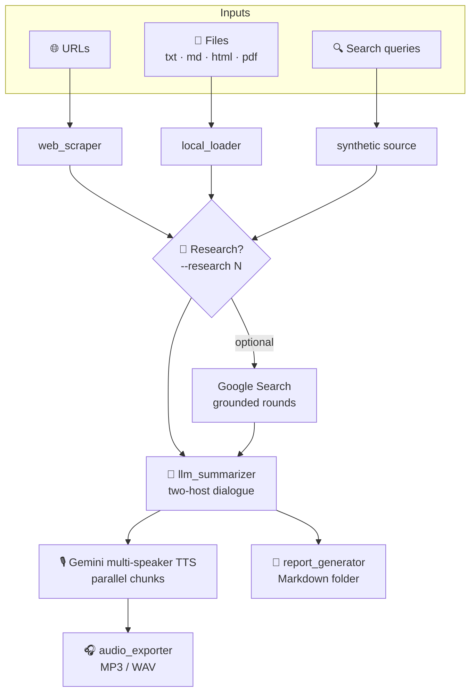

# 🎙️ tts-podcast

[](https://pypi.org/project/tts-podcast/)


> Turn any article, document, or search query into a **two-voice podcast** —
> scraped, researched, scripted, and voiced by Google Gemini.

Feed it URLs, local files, or a topic to search. It scrapes the sources,
optionally runs iterative Google-Search-grounded research, writes a natural
back-and-forth dialogue between two hosts, and synthesises an MP3 (or WAV)
with Gemini's multi-speaker TTS — plus an optional folder of Markdown reports.

---

## ✨ Features

| | Feature | Description |
|---|---|---|
| 🌐 | **Any URL → podcast** | Feed one or several article URLs; scraping, dialogue, and audio are handled end-to-end. |
| 📄 | **Local documents** | Include `.txt`, `.md`, `.html`, or `.pdf` files with `-f` — no network request. |
| 🔍 | **Web-search queries** | Pass a natural-language topic with `-s`; the research stage investigates it via Google Search grounding. |
| 🧠 | **Iterative research** | `--research N` runs *N* sequential grounded rounds, each drilling into the gaps the last one left. |
| 🎭 | **Multi-voice TTS** | Two distinct Gemini voices with configurable personalities, scene, and delivery cues. |
| 👥 | **Named voice duos** | Five built-in pairings (`contrast` default, `warm`, `explorer`, `journalist`, `debate`) — or define your own from all 30 prebuilt Gemini voices. |
| 🎨 | **Style & angle control** | Presets, free-text style, per-episode angle, and per-speaker overlays — without touching the baseline voice acting. |
| 📑 | **Report folder** | Opt-in with `--report`: writes `overview.md`, `sources.md`, `script.md`, `research.md`, and `summary.md` next to the audio. |
| 💸 | **Token & cost tracking** | Accumulates per-model token usage and estimates cost from configurable pricing. |
| 🥷 | **Stealth fallback** | Optional CloakBrowser retry for pages that block plain scraping (Cloudflare, 403/429, JS-only). |

---

## 🚀 Quickstart

Get a podcast out of a single URL in three steps:

```bash
# 1. Get the Gemini API key into your environment
export GEMINI_API_KEY=<your key>

# 2. Make sure ffmpeg is available (audio export needs it)
brew install ffmpeg            # macOS  ·  apt: sudo apt install ffmpeg

# 3. Run it — no install required
uvx tts-podcast run https://blog.example.com/article
```

That's it: you get an `.mp3`. Add `--report` for a `tts_<stem>/` folder of
Markdown reports, or `-O out.mp3` / `-O -` to choose the filename or stream to
stdout. Want to hear the script before spending TTS tokens? Add `-n` for a dry run.

> Prefer a permanent install or `pip`? See [Installation](#-installation).

---

## 👥 Voice duos

A *duo* bundles both speakers — name, prebuilt Gemini voice, and baseline
personality — under one slug, so you swap the whole pairing at once instead of
editing `speaker1` / `speaker2` by hand.

```bash
tts-podcast duos          # list them (no API key needed)
tts-podcast run --duo journalist https://blog.example.com/article
```

### Built-in duos

| Slug | Speaker 1 | Speaker 2 | Vibe |
|---|---|---|---|
| `contrast` *(default)* | Puck (Upbeat) | Kore (Firm) | High timbre contrast — Google's own multi-speaker pairing |
| `warm` | Sulafat (Warm) | Achird (Friendly) | Accessible, mainstream feel |
| `explorer` | Fenrir (Excitable) | Sadaltager (Knowledgeable) | Excited explorer + calm expert; vulgarisation-friendly |
| `journalist` | Zephyr (Bright) | Algieba (Smooth) | Fast-paced tech-journalism feel |
| `debate` | Laomedeia (Upbeat) | Algenib (Gravelly) | Opposing viewpoints — optimist vs skeptic (pair with `--preset debate`) |

> Gemini doesn't officially document voice gender; pairings are curated from
> each voice's [official descriptor][voices] plus community reports. Audition
> them in [Google AI Studio][voices] before committing.

### Custom duos

Define your own under `gemini.duos`; they merge over the built-ins (same slug
overrides, a new slug adds one):

```yaml
gemini:
  default_duo: my_duo
  duos:
    my_duo:
      description: "my custom pairing"
      speaker1:
        name: Robin
        voice: Laomedeia   # Upbeat
        personality: "techno-optimist; champions the upside"
      speaker2:
        name: Sasha
        voice: Algenib     # Gravelly
        personality: "hard-nosed skeptic; probes risks and costs"
```

**Resolution precedence:** `--duo` › `gemini.default_duo` ›
legacy `gemini.speaker1` / `speaker2` blocks › built-in `contrast`. A config
that defines only the legacy `speakerN` blocks keeps working unchanged.

### Auto-generated duo (`--duo auto`)

Pass `--duo auto` to let Gemini invent a duo tailored to the content itself.
After scraping and research, the pipeline asks the model to pick two voices
from the full 30-voice palette and write personalities that fit the topic,
tone, and language of the episode.

```bash
tts-podcast run --duo auto https://blog.example.com/article
```

The model returns a structured JSON object (voice names validated against the
enum of known voices), which is injected into `gemini.speaker1` / `speaker2`
at the same single injection point as every other duo resolution — the rest
of the pipeline sees it as a normal duo and behaves identically.

Use `--report` to see the generated duo description in the report folder
(`tts_<stem>/overview.md`).

---

## 🎚️ Usage

```bash
# Single URL, no research
tts-podcast run https://blog.example.com/article

# Multiple URLs with two rounds of complementary research
tts-podcast run -R 2 https://blog.example.com/a https://blog.example.com/b

# Local document — no network request
tts-podcast run -n -f paper.pdf

# Web-search query — research auto-bumped to 1 if it's the only input
tts-podcast run -n -s "agentic AI memory systems"

# Mixed: URL + local file + search query in one episode
tts-podcast run -n https://blog.example.com/article -f notes.md -s "follow-up topic"

# Preview the dialogue without calling TTS
tts-podcast run -n https://blog.example.com/article

# Generate the dialogue script but skip audio synthesis (add --report for the folder)
tts-podcast run -A https://blog.example.com/article

# Pick the output filename, or stream the audio straight to stdout
tts-podcast run -O episode.mp3 https://blog.example.com/article
tts-podcast run -O - https://blog.example.com/article > episode.mp3

# Style & angle: nudge tone via preset + free text, focus on one angle
tts-podcast run -R 1 \
    --preset academic \
    --style "extra rigorous, French academic feel" \
    --angle "the regulatory implications" \
    https://blog.example.com/article

# Per-episode speaker overlay (TTS voice acting stays unchanged)
tts-podcast run \
    --speaker1-style "more skeptical than usual" \
    --speaker2-style "extra warm and forgiving" \
    https://blog.example.com/article

# Opposing viewpoints, structured as a debate
tts-podcast run --duo debate --preset debate https://blog.example.com/article
```

> Running from a source checkout? Prefix every command with `uv run`
> (e.g. `uv run tts-podcast run …`).

### Key flags

| Flag | Description |
|---|---|
| `-f, --file FILE` | Local document to include (repeatable). `.txt`, `.md`, `.html`, `.pdf`. |
| `-s, --search QUERY` | Web-search query to seed the podcast (repeatable). Auto-bumps research to 1 if search-only. |
| `-R, --research N` | Number of Google-Search-grounded research rounds (default `0`). |
| `--duo NAME` | Named voice duo (`contrast`, `warm`, `explorer`, `journalist`, `debate`). |
| `--preset NAME` | Style preset: `casual`, `academic`, `humorous`, `debate`, `vulgarized`, or `none`. |
| `--style TEXT` | Free-text style guidance (≤ 500 chars). Composes with `--preset`. |
| `--speaker1-style` / `--speaker2-style` | Per-episode overlay for one speaker; baseline voice unchanged. |
| `--angle TEXT` | Episode angle. Steers the dialogue and the first research round only. |
| `-d, --duration MIN` | Target episode duration in minutes. |
| `-n, --dry-run` | Print dialogue to stdout, no TTS. |
| `-A, --no-audio` | Skip TTS synthesis and audio export. |
| `-o, --output-dir DIR` | Output directory (overrides config). |
| `-O, --output FILE` | Output file path or bare name. `-` streams the audio to stdout. |
| `-r, --report` | Generate the report folder (off by default). |
| `-v, --verbose` | Enable DEBUG logging. |

Run `tts-podcast run --help` for the full list.

---

## ⚙️ Configuration

Scaffold a config file, then export your Gemini API key:

```bash
tts-podcast config init
export GEMINI_API_KEY=<your key>
```

The config lives at `$XDG_CONFIG_HOME/tts-podcast/config.yaml` (typically
`~/.config/tts-podcast/config.yaml`). The full schema is in
[`config.example.yaml`](config.example.yaml). The API key is read at runtime
from the env var named by `gemini.api_key_env` (default `GEMINI_API_KEY`) and
loaded from a local `.env` automatically.

```yaml
gemini:
  api_key_env: GEMINI_API_KEY
  default_duo: contrast        # persistent voice pairing
  dialogue:
    target_duration_minutes: 8
```

---

## 📦 Installation

```bash
uvx tts-podcast …                # run without installing
uv tool install tts-podcast      # persistent install via uv
pipx install tts-podcast         # via pipx
pip install tts-podcast          # plain pip
```

**Optional stealth-browser fallback** (pulls a ~200 MB Chromium on first run):

```bash
uv tool install "tts-podcast[cloak]"
```

**`ffmpeg` is required for audio export** — skip only if you stick to
`--no-audio` / `--dry-run`:

```bash
brew install ffmpeg          # macOS
sudo apt install ffmpeg      # Debian / Ubuntu
```

### From source

```bash
git clone https://github.com/obeone/tts-podcast.git
cd tts-podcast
uv sync                      # Python 3.13+
uv run tts-podcast --help
```

---

## 📂 Output layout

```text
<output_dir>/
├── <stem>.mp3
└── tts_<stem>/            # only with --report
    ├── overview.md       # metadata, link breakdown, token/cost summary
    ├── sources.md        # per-source content (title, URL, summary, full text)
    ├── script.md         # full two-host dialogue
    ├── research.md       # only when --research >= 1
    └── summary.md        # synthetic reference sheet with categorised links
```

The stem combines the first URL's hostname, a 6-char digest of the URL list,
and today's date — e.g. `arxiv.org-a1b2c3-2026-06-07.mp3`. Override the whole
filename with `-O NAME` (a bare name lands in `<output_dir>`), or pass `-O -`
to stream the audio to stdout instead of writing a file.

---

## 💸 Research cost note

Each `--research` round is a separate Gemini call with Google Search grounding
enabled, which adds search overhead to the standard input-token cost. The tool
logs the cumulative cost after each round, so you can watch the bill while
iterating.

---

## 🧪 Development

```bash
uv sync                          # install deps (Python 3.13+)
uv run pytest tests/ -q          # run the test suite
uv run ruff check src/ tests/    # lint
```

Tests mock the Gemini SDK rather than hitting the network. See
[`CLAUDE.md`](CLAUDE.md) for the architecture deep-dive and key invariants.

---

## 🔊 How it works



The pipeline is strictly linear: each stage hands typed data to the next, no
hidden shared state. Scrape failures don't abort the run — it continues with
whatever succeeded.

---

## 📝 License

MIT © [Grégoire Compagnon](mailto:obeone@obeone.org)

[grounding]: https://ai.google.dev/gemini-api/docs/google-search
[voices]: https://ai.google.dev/gemini-api/docs/speech-generation
