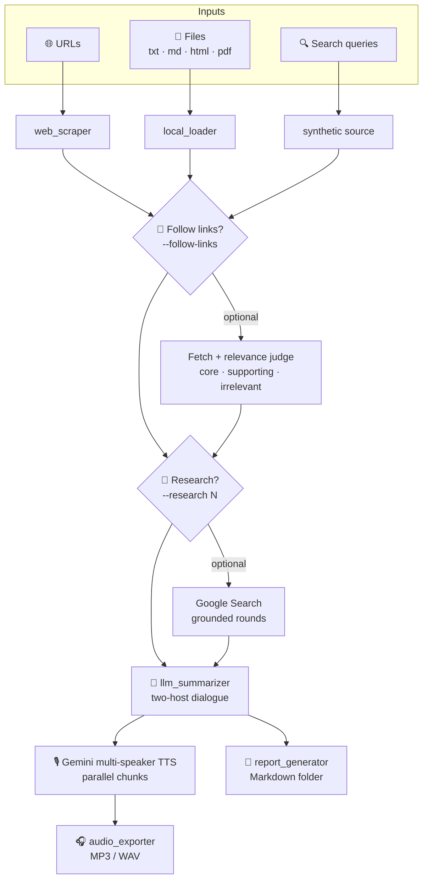

# 🎙️ tts-podcast

[](https://pypi.org/project/tts-podcast/)


> Turn any article, document, or search query into a **two-voice podcast** —
> scraped, researched, scripted, and voiced by Google Gemini.

Feed it URLs, local files, or a topic to search. It scrapes the sources,
optionally runs iterative Google-Search-grounded research, writes a natural
back-and-forth dialogue between two hosts, and synthesises an MP3 (or WAV)
with Gemini's multi-speaker TTS — plus an optional folder of Markdown reports.

---

## ✨ Features

| | Feature | Description |
|---|---|---|
| 🌐 | **Any URL → podcast** | Feed one or several article URLs; scraping, dialogue, and audio are handled end-to-end. |
| 📄 | **Local documents** | Include `.txt`, `.md`, `.html`, or `.pdf` files with `-f` — no network request. |
| 🔍 | **Web-search queries** | Pass a natural-language topic with `-s`; the research stage investigates it via Google Search grounding. |
| 🧠 | **Iterative research** | `--research N` runs *N* sequential grounded rounds, each drilling into the gaps the last one left. |
| 🔗 | **Follow links** | `--follow-links` discovers and traverses interesting links inside the inputs (heuristic pre-filter + LLM relevance judge); kept pages feed research and dialogue. |
| 🎭 | **Multi-voice TTS** | Two distinct Gemini voices with configurable personalities, scene, and delivery cues. |
| 👥 | **Named voice duos** | Five built-in pairings (`contrast` default, `warm`, `explorer`, `journalist`, `debate`), each a different conversational dynamic. Or define your own from all 30 prebuilt Gemini voices. |
| 🎚️ | **Per-speaker voice direction** | Give each host its own register, tempo, articulation, and breathing so the two never render with the same delivery. |
| 🎨 | **Style & angle control** | Presets, free-text style, per-episode angle, and per-speaker overlays — without touching the baseline voice acting. |
| 📑 | **Report folder** | Opt-in with `--report`: writes `overview.md`, `sources.md`, `script.md`, `research.md`, and `summary.md` next to the audio. |
| 💸 | **Token & cost tracking** | Accumulates per-model token usage and estimates cost from configurable pricing. |
| 🥷 | **Stealth fallback** | Optional CloakBrowser retry for pages that block plain scraping (Cloudflare, 403/429, JS-only). |

---

## 🚀 Quickstart

Get a podcast out of a single URL in three steps:

```bash
# 1. Get the Gemini API key into your environment
export GEMINI_API_KEY=<your key>

# 2. Make sure ffmpeg is available (audio export needs it)
brew install ffmpeg            # macOS  ·  apt: sudo apt install ffmpeg

# 3. Run it — no install required
uvx tts-podcast run https://blog.example.com/article
```

That's it: you get an `.mp3`. Add `--report` for a `tts_<stem>/` folder of
Markdown reports, or `-O out.mp3` / `-O -` to choose the filename or stream to
stdout. Want to hear the script before spending TTS tokens? Add `-n` for a dry run.

> Prefer a permanent install or `pip`? See [Installation](#-installation).

---

## 👥 Voice duos

A *duo* bundles both speakers (name, prebuilt Gemini voice, baseline
personality, and per-speaker voice direction) under one slug, so you swap the
whole pairing at once instead of editing `speaker1` / `speaker2` by hand.

```bash
tts-podcast duos          # list them (no API key needed)
tts-podcast run --duo journalist https://blog.example.com/article
```

### Built-in duos

Each duo is a different *conversational dynamic*, not the same "excited host
plus calm analyst" pairing under five names. The ten voices are all distinct,
and inside a duo the two voice directions are opposed on register, tempo,
articulation, and breathing.

| Slug | Speaker 1 | Speaker 2 | Dynamic |
|---|---|---|---|
| `contrast` *(default)* | Theo, voice Puck (Upbeat) | Nadia, voice Kore (Firm) | **Tempo flip.** An idea machine firing in bursts against an editor who lands it in one sentence. They agree, they just run at different speeds. |
| `warm` | Vera, voice Gacrux (Mature) | Milo, voice Achird (Friendly) | **Transmission.** A settled storyteller hands the thread to the listener's stand-in. Long turn, short reaction, real silence. |
| `explorer` | Iris, voice Achernar (Soft) | Sam, voice Sadachbia (Lively) | **Co-discovery.** Two non-experts approaching the same thing from opposite ends; nobody holds the answer, nobody corrects the other. |
| `journalist` | Nora, voice Pulcherrima (Forward) | Marc, voice Charon (Informative) | **Role asymmetry.** A desk anchor asking short questions, a field correspondent answering long and sourced. |
| `debate` | Robin, voice Autonoe (Bright) | Sasha, voice Algenib (Gravelly) | **Open conflict.** Optimist against skeptic, one escalating up and the other down (pair with `--preset debate`). |

Each duo also ships a `scene` and a `pace` matching its dynamic. Those are
defaults: anything you set in `gemini.tts_style.scene` / `.pace` wins.

> Gemini doesn't officially document voice gender; pairings are curated from
> each voice's [official descriptor][voices] plus community reports. Audition
> them in [Google AI Studio][voices] before committing.

### Voice direction

Two hosts used to come out sounding like the same person: the TTS preamble
described *who* each host was but never *how* they spoke, so the model averaged
both deliveries into one. `voice_direction` fixes that: an optional
per-speaker Director's Note covering four axes and nothing else.

- **register** (low chest, mid, bright upper, forward placement)
- **tempo** (staccato bursts, metronomic, half speed)
- **articulation** (hard attacks and clipped endings, legato, rounded vowels)
- **breathing** (silent, snatched on the fly, a full beat at every stop)

It is read **only** by the TTS preamble, so it changes how a line sounds and
never what the script says. It is the mirror image of `style_overlay`, which is
dialogue-only and never reaches TTS.

Writing your own: pick one host, then make the other the opposite on all four
axes. Describe a steady trait, not a trajectory ("low and slow", not "starts
calm then builds"), and keep each note under ~160 characters (it rides along
with every TTS request).

```yaml
gemini:
  default_duo: my_duo
  duos:
    my_duo:
      description: "my custom pairing"
      scene: "a bare table, two microphones facing each other"
      pace: "quick exchanges, no dead air"
      speaker1:
        name: Robin
        voice: Autonoe     # Bright
        personality: "a techno-optimist who champions the upside"
        voice_direction: >-
          Bright upper register, leaning into the mic. Quick, no gap between
          sentences; pitch climbing through the clause, breath snatched on the fly.
      speaker2:
        name: Sasha
        voice: Algenib     # Gravelly
        personality: "a hard-nosed skeptic who probes risks and costs"
        voice_direction: >-
          Low gravelly register, dropping in volume instead of rising. Slow, a
          long beat before each answer; blunt consonants, falling endings.
```

The same key works on legacy `gemini.speaker1` / `speaker2` blocks. Leave it out
and the preamble is byte-identical to what it was before the feature existed, so
existing configs sound exactly as they did.

A voice direction does cost room: it rides at the top of every TTS request,
alongside the dialogue itself. The tool measures the preamble your config
actually renders and sizes the dialogue chunks against what is left. As long as
that whole preamble stays at or under 800 bytes, the chunks keep their full
size, so the request count and the number of audio joins are unchanged. Past
that, chunks shrink byte for byte and an episode is cut into a few more pieces.

Voice directions are not the only thing in the preamble: the host personalities,
`tts_style.scene` and `tts_style.pace` all sit in it too. A config with no voice
directions but a long `scene` can still cross the 800-byte line and get slightly
smaller chunks than it used to. Keeping each direction under about 160
characters and the scene to one line leaves comfortable room; when a config
really does run out, the tool logs a warning naming the fields to trim.

### Custom duos

Duos defined under `gemini.duos` merge over the built-ins: the same slug
overrides one, a new slug adds one. Only `name` and `voice` are required per
speaker; `personality`, `voice_direction`, `description`, `scene`, and `pace`
are all optional.

Write `personality` as a noun phrase starting with `a` / `an` / `the`: the TTS
preamble renders it as `<name> is <personality>.`, so a bare job title
("desk anchor; presses with short questions") ships broken English to the model
and pushes it back toward one averaged delivery.

**Resolution precedence:** `--duo` › `gemini.default_duo` ›
legacy `gemini.speaker1` / `speaker2` blocks › built-in `contrast`. A config
that defines only the legacy `speakerN` blocks keeps working unchanged.

---

## 🎚️ Usage

```bash
# Single URL, no research
tts-podcast run https://blog.example.com/article

# Multiple URLs with two rounds of complementary research
tts-podcast run -R 2 https://blog.example.com/a https://blog.example.com/b

# Local document — no network request
tts-podcast run -n -f paper.pdf

# Web-search query — research auto-bumped to 1 if it's the only input
tts-podcast run -n -s "agentic AI memory systems"

# Follow interesting links found inside the inputs (2 hops deep)
tts-podcast run -L --follow-depth 2 https://blog.example.com/article

# Same, but fetch at most 8 pages in total, 4 per hop
tts-podcast run -L --follow-depth 2 --follow-max-links 8 --follow-max-links-per-hop 4 \
  https://blog.example.com/article

# Mixed: URL + local file + search query in one episode
tts-podcast run -n https://blog.example.com/article -f notes.md -s "follow-up topic"

# Preview the dialogue without calling TTS
tts-podcast run -n https://blog.example.com/article

# Generate the dialogue script but skip audio synthesis (add --report for the folder)
tts-podcast run -A https://blog.example.com/article

# Pick the output filename, or stream the audio straight to stdout
tts-podcast run -O episode.mp3 https://blog.example.com/article
tts-podcast run -O - https://blog.example.com/article > episode.mp3

# Style & angle: nudge tone via preset + free text, focus on one angle
tts-podcast run -R 1 \
    --preset academic \
    --style "extra rigorous, French academic feel" \
    --angle "the regulatory implications" \
    https://blog.example.com/article

# Per-episode speaker overlay (TTS voice acting stays unchanged)
tts-podcast run \
    --speaker1-style "more skeptical than usual" \
    --speaker2-style "extra warm and forgiving" \
    https://blog.example.com/article

# Opposing viewpoints, structured as a debate
tts-podcast run --duo debate --preset debate https://blog.example.com/article
```

> Running from a source checkout? Prefix every command with `uv run`
> (e.g. `uv run tts-podcast run …`).

### Key flags

| Flag | Description |
|---|---|
| `-f, --file FILE` | Local document to include (repeatable). `.txt`, `.md`, `.html`, `.pdf`. |
| `-s, --search QUERY` | Web-search query to seed the podcast (repeatable). Auto-bumps research to 1 if search-only. |
| `-R, --research N` | Number of Google-Search-grounded research rounds (default `0`). |
| `-L, --follow-links` | After scraping inputs, follow interesting links inside them (heuristic pre-filter + LLM relevance judge). Fetched pages feed research and dialogue. |
| `--follow-depth N` | Link-following hops when `--follow-links` is set (default `1`). |
| `--follow-max-links N` | Cap on the total number of links fetched across all hops (default `20`, config `follow.max_links_total`). |
| `--follow-max-links-per-hop N` | Cap on the number of links fetched per hop (default `5`, config `follow.max_links_per_level`). |
| `--duo NAME` | Named voice duo (`contrast`, `warm`, `explorer`, `journalist`, `debate`). |
| `--preset NAME` | Style preset: `casual`, `academic`, `humorous`, `debate`, `vulgarized`, or `none`. |
| `--style TEXT` | Free-text style guidance (≤ 500 chars). Composes with `--preset`. |
| `--speaker1-style` / `--speaker2-style` | Per-episode overlay for one speaker; baseline voice unchanged. |
| `--angle TEXT` | Episode angle. Steers the dialogue and the first research round only. |
| `-d, --duration MIN` | Target episode duration in minutes. |
| `-n, --dry-run` | Print dialogue to stdout, no TTS. |
| `-A, --no-audio` | Skip TTS synthesis and audio export. |
| `-o, --output-dir DIR` | Output directory (overrides config). |
| `-O, --output FILE` | Output file path or bare name. `-` streams the audio to stdout. |
| `-r, --report` | Generate the report folder (off by default). |
| `-v, --verbose` | Enable DEBUG logging. |

Run `tts-podcast run --help` for the full list.

---

## 🔗 Following links

`-L` / `--follow-links` treats your inputs as a starting point rather than the
whole corpus: once they are scraped, it walks the hyperlinks inside them, keeps
the pages that turn out to be on topic, and feeds those into both the research
stage and the dialogue.

```bash
tts-podcast run -L https://blog.example.com/article
tts-podcast run -L --follow-depth 2 --follow-max-links 8 https://blog.example.com/article
```

Selection happens twice, because guessing from a URL is cheap and guessing from
the content is accurate:

1. **Before fetching**, a URL heuristic drops the obvious noise (asset files,
   anchors, trackers, social buttons, login and checkout paths) and keeps
   anything that could be real content.
2. **After fetching**, one Gemini call reads what each page actually says and
   labels it `core`, `supporting`, or `irrelevant` against your topic. The
   first two are kept, and their verdict follows them into the dialogue prompt,
   the research prompt, and the report. The judge fails open: if the call
   fails, pages are kept as `supporting` rather than silently dropped.

Every hop costs one Gemini call on top of the fetches, so the traversal is
capped on both axes:

| Cap | Default | CLI | Config |
|---|---|---|---|
| Hops | 1 | `--follow-depth` | (none) |
| Links per hop | 5 | `--follow-max-links-per-hop` | `follow.max_links_per_level` |
| Links in total | 20 | `--follow-max-links` | `follow.max_links_total` |

The total cap overrides depth × per-hop, so it is the single number to lower
when a run feels expensive. A cap of zero is rejected up front instead of
turning the whole stage into a silent no-op.

---

## ⚙️ Configuration

Scaffold a config file, then export your Gemini API key:

```bash
tts-podcast config init
export GEMINI_API_KEY=<your key>
```

The config lives at `$XDG_CONFIG_HOME/tts-podcast/config.yaml` (typically
`~/.config/tts-podcast/config.yaml`). The full schema is in
[`config.example.yaml`](config.example.yaml). The API key is read at runtime
from the env var named by `gemini.api_key_env` (default `GEMINI_API_KEY`) and
loaded from a local `.env` automatically.

```yaml
gemini:
  api_key_env: GEMINI_API_KEY
  default_duo: contrast        # persistent voice pairing
  dialogue:
    target_duration_minutes: 8
```

---

## 📦 Installation

```bash
uvx tts-podcast …                # run without installing
uv tool install tts-podcast      # persistent install via uv
pipx install tts-podcast         # via pipx
pip install tts-podcast          # plain pip
```

**Optional stealth-browser fallback** (pulls a ~200 MB Chromium on first run):

```bash
uv tool install "tts-podcast[cloak]"
```

**`ffmpeg` is required for audio export** — skip only if you stick to
`--no-audio` / `--dry-run`:

```bash
brew install ffmpeg          # macOS
sudo apt install ffmpeg      # Debian / Ubuntu
```

### From source

```bash
git clone https://github.com/obeone/tts-podcast.git
cd tts-podcast
uv sync                      # Python 3.13+
uv run tts-podcast --help
```

---

## 📂 Output layout

```text
<output_dir>/
├── <stem>.mp3
└── tts_<stem>/            # only with --report
    ├── overview.md       # metadata, link breakdown, token/cost summary
    ├── sources.md        # per-source content (title, URL, summary, full text)
    ├── script.md         # full two-host dialogue
    ├── research.md       # only when --research >= 1
    └── summary.md        # synthetic reference sheet with categorised links
```

The stem combines the first URL's hostname, a 6-char digest of the URL list,
and today's date — e.g. `arxiv.org-a1b2c3-2026-06-07.mp3`. Override the whole
filename with `-O NAME` (a bare name lands in `<output_dir>`), or pass `-O -`
to stream the audio to stdout instead of writing a file.

---

## 💸 Research cost note

Each `--research` round is a separate Gemini call with Google Search grounding
enabled, which adds search overhead to the standard input-token cost. The tool
logs the cumulative cost after each round, so you can watch the bill while
iterating.

`--follow-links` bills on top of that: one relevance-judging call per hop, plus
the pages it feeds into research and dialogue as extra input tokens. Keep
`--follow-max-links` low on a first run and raise it once you know a source is
worth mining.

---

## 🧪 Development

```bash
uv sync                          # install deps (Python 3.13+)
uv run pytest tests/ -q          # run the test suite
uv run ruff check src/ tests/    # lint
```

Tests mock the Gemini SDK rather than hitting the network. See
[`CLAUDE.md`](CLAUDE.md) for the architecture deep-dive and key invariants.

---

## 🔊 How it works


```mermaid
flowchart TB
    subgraph IN[" Inputs "]
        U[🌐 URLs]
        F[📄 Files<br/>txt · md · html · pdf]
        S[🔍 Search queries]
    end

    U --> SC[web_scraper]
    F --> LL[local_loader]
    S --> SY[synthetic source]

    SC --> FL{🔗 Follow links?<br/>--follow-links}
    LL --> FL
    SY --> FL

    FL -->|optional| FF[Fetch + relevance judge<br/>core · supporting · irrelevant]
    FL --> R{🧠 Research?<br/>--research N}
    FF --> R

    R -->|optional| RR[Google Search<br/>grounded rounds]
    R --> D[💬 llm_summarizer<br/>two-host dialogue]
    RR --> D

    D --> T[🎙️ Gemini multi-speaker TTS<br/>parallel chunks]
    T --> A[🎧 audio_exporter<br/>MP3 / WAV]
    D --> REP[📑 report_generator<br/>Markdown folder]
```

The pipeline is strictly linear: each stage hands typed data to the next, no
hidden shared state. Scrape failures don't abort the run — it continues with
whatever succeeded.

---

## 📝 License

MIT © [Grégoire Compagnon](mailto:obeone@obeone.org)

[grounding]: https://ai.google.dev/gemini-api/docs/google-search
[voices]: https://ai.google.dev/gemini-api/docs/speech-generation
